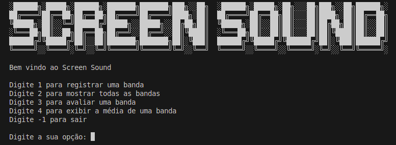

# Screen Sound

Aplicação tem como objetivo avaliar bandas e armazenar informações em ambiente local.

## :hammer: Funcinoalidades

- `Registrar(1)`: Registra a banda inserida pelo usuario
- `Listar(2)`: Lista todas as bandas cadastradas
- `Avaliar(3)`: Avaliar uma banda
- `Exibir a média(4)`: Permite selecionar uma banda e exibir sua média
- `Sair(-1)`: Fecha a applicação

# Tecnologias utilizadas

- `C#`